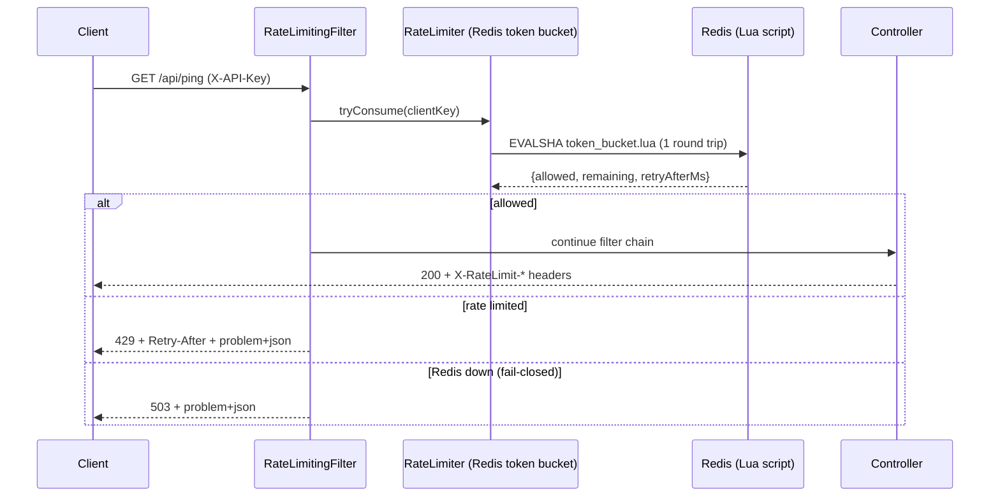

# Distributed Rate Limiter (Spring Boot + Redis + Lua)

[](https://github.com/GiulioGirardi/rate-limiter/actions/workflows/ci.yml)


[](LICENSE)

A per-client **token bucket** rate limiter that stays correct when an API runs on many instances.
All bucket state lives in Redis, and every decision is a single atomic Lua script call, so there are
no race conditions between instances, threads or requests.

## Highlights

- **Atomic by design**: refill, check, deduct and persist run in one `EVALSHA`. No read-modify-write in Java.
- **One clock for the whole fleet**: the script uses Redis `TIME`, so app-server clock drift doesn't affect fairness.
- **Standard HTTP semantics**: `429` with an accurate `Retry-After`, `X-RateLimit-Limit` / `X-RateLimit-Remaining` headers and RFC 9457 `problem+json` error bodies.
- **Explicit failure policy**: fail-open (allow and flag as degraded) or fail-closed (`503`), with a 250 ms Redis latency budget.
- **Observable**: Micrometer counter `rate_limiter.decisions{outcome=...}` exposed through Spring Boot Actuator.
- **Tested against real Redis**: Testcontainers integration tests, including a concurrency test showing that 320 parallel requests never exceed the bucket capacity.

## How it works



### Token bucket

Each client has a bucket with `capacity` tokens (the burst size) that refills at `refill-rate-per-second`.
Each request costs `cost-per-request` tokens. The Lua script ([`token_bucket.lua`](src/main/resources/lua/token_bucket.lua)):

1. reads `tokens` and `last_refill` from the client's hash (a new or corrupted bucket starts full),
2. refills: `tokens = min(capacity, tokens + elapsed_ms * refill_rate / 1000)`,
3. allows and deducts if `tokens >= cost`, otherwise computes `retry_after_ms = (cost - tokens) / refill_rate`,
4. persists the bucket and sets a TTL of `capacity / refill_rate`, the time after which an idle bucket would be full again and can safely be forgotten.

Redis runs scripts atomically, so concurrent requests for the same client are serialized without locks.

### Client identity

[`ApiKeyOrIpClientKeyResolver`](src/main/java/io/github/giuliogirardi/ratelimiter/web/ApiKeyOrIpClientKeyResolver.java)
uses the `X-API-Key` header (stored as a SHA-256 hash, so raw keys never reach Redis or logs) and falls back to the
client IP. Implement `ClientKeyResolver` to limit by authenticated user, tenant or route instead.

## Project structure

```
src/main/java/io/github/giuliogirardi/ratelimiter
├── config/   RateLimiterProperties (validated record), RateLimiterConfiguration (bean wiring)
├── limiter/  RateLimiter (strategy interface), RedisTokenBucketRateLimiter,
│             MeteredRateLimiter (metrics decorator), RateLimitResult, RateLimitDecision
└── web/      RateLimitingFilter, ClientKeyResolver, ApiKeyOrIpClientKeyResolver, PingController
src/main/resources/lua/token_bucket.lua
```

Design patterns used: **Strategy** (`RateLimiter`, `ClientKeyResolver`), **Decorator** (`MeteredRateLimiter`),
**static factory methods** on the immutable `RateLimitResult` record.
The reasoning behind each decision is in [docs/DESIGN_DECISIONS.md](docs/DESIGN_DECISIONS.md).

## Running it

### Docker Compose (app + Redis)

```bash
docker compose up --build
```

### Locally (requires Redis on `localhost:6379`)

```bash
./mvnw spring-boot:run
```

### Try it

With the default configuration (burst of 2, then ~2 requests/minute):

```bash
$ curl -i -H "X-API-Key: demo" localhost:8080/api/ping
HTTP/1.1 200
X-RateLimit-Limit: 2
X-RateLimit-Remaining: 1
{"status":"ok"}

$ curl -i -H "X-API-Key: demo" localhost:8080/api/ping
HTTP/1.1 200
X-RateLimit-Limit: 2
X-RateLimit-Remaining: 0
{"status":"ok"}

$ curl -i -H "X-API-Key: demo" localhost:8080/api/ping
HTTP/1.1 429
X-RateLimit-Limit: 2
X-RateLimit-Remaining: 0
Retry-After: 30
Content-Type: application/problem+json
{"type":"about:blank","title":"Too Many Requests","status":429,"detail":"Rate limit exceeded, retry after the Retry-After delay"}
```

Metrics:

```bash
curl "localhost:8080/actuator/metrics/rate_limiter.decisions?tag=outcome:rate_limited"
```

## Configuration

| Property | Default | Description |
|---|---|---|
| `rate-limiter.capacity` | *required* | Maximum tokens per bucket (burst size). |
| `rate-limiter.refill-rate-per-second` | *required* | Tokens added per second. `requests-per-minute / 60`. |
| `rate-limiter.cost-per-request` | `1` | Tokens consumed per request. Must not exceed `capacity`. |
| `rate-limiter.fail-open-on-redis-error` | `false` | `true`: allow traffic when Redis fails (`X-RateLimit-Degraded: true`). `false`: respond `503`. |
| `rate-limiter.excluded-paths` | `/actuator/**` | Ant-style paths that are never rate limited. |
| `spring.data.redis.timeout` | `250ms` | Latency budget per decision before the failure policy applies. |

Invalid values (for example `capacity: 0` or `cost-per-request` greater than `capacity`) stop the application at startup.
Every property can be overridden through environment variables, e.g. `RATE_LIMITER_CAPACITY=100`.

### Fail-open vs fail-closed

| | Fail-open | Fail-closed (default) |
|---|---|---|
| Redis down | Request allowed, flagged `X-RateLimit-Degraded: true` | `503 Service Unavailable` |
| Protects | Availability of your API | Downstream systems from unbounded traffic |
| Good for | Public, user-facing APIs | Expensive or sensitive backends |

## Tests

```bash
./mvnw verify
```

- **Unit tests**: limiter result mapping and failure policy, filter HTTP semantics, metrics, identity resolution and configuration validation.
- **Integration tests** (Testcontainers, need Docker; skipped automatically without it): the real Lua script against Redis 7 (burst, refill, TTL, per-client isolation, corrupted state, a 320-request concurrency test) and an end-to-end HTTP test.

CI runs the whole suite and builds the Docker image on every push.

## Known limitations

- `X-API-Key` is used for identity, not authentication: a caller could rotate keys to get fresh buckets.
  In production, resolve the key from an authenticated principal or validate API keys first.
- Behind a load balancer, set `server.forward-headers-strategy=native` so the IP fallback sees the real client address.
- A single Redis instance is the throughput ceiling. See the [roadmap](docs/DESIGN_DECISIONS.md#roadmap) for scaling options.

## License

[MIT](LICENSE)
